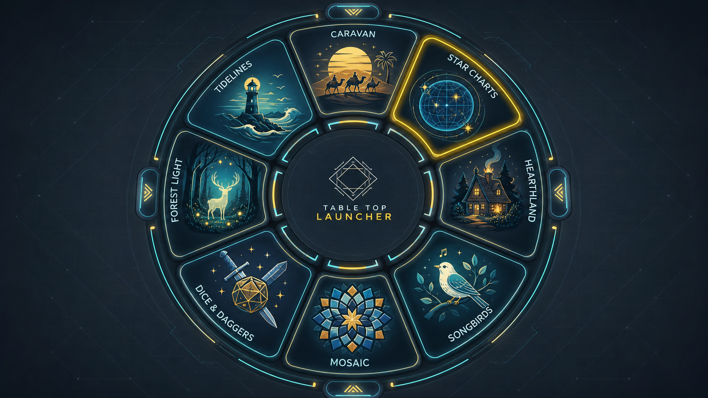
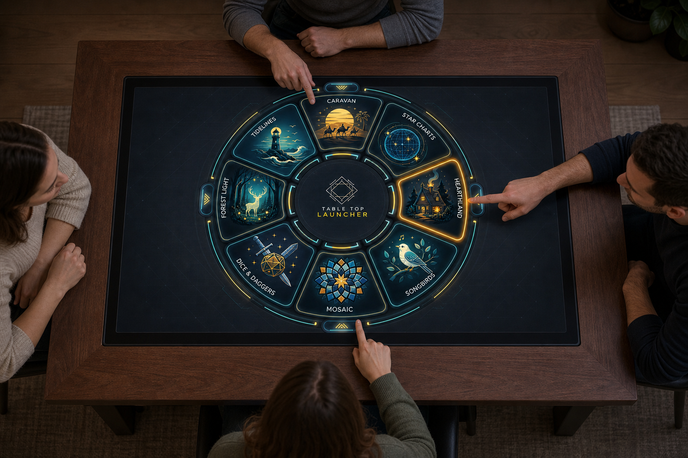

# Omnidirectional tabletop UX

## Device truth

Table Top Launcher is not a responsive website for personal devices. It is the
idle surface of a large 16:9 touch screen installed horizontally in a table.
People arrive from any edge or corner, often while others are already touching
the surface. There is no head of the table and therefore no global “upright”.

The LauncherUI mockups got this context right: an embedded illuminated table,
large tactile game objects, an orbital selection model, and perimeter access.
This design retains those ideas and removes every flow unsupported by the
actual database contract.

## Scope: title, icon, URL

Each Firestore application becomes one game tile:

- the icon is the recognition target;
- the title is the only visible metadata; and
- tapping the tile opens the validated URL immediately.

There is no details page, setup screen, launch confirmation, player count,
duration, description, category, search, filter, favourite, recent history,
profile, or settings. The game owns the experience after the tap.

## Reference mockup: launcher surface



The implementation reference is an edge-to-edge radial carousel:

- a quiet center mark anchors the surface without acting as a category or menu;
- large icon/title tiles form a broad ring around it;
- each tile's baseline points outward, toward the nearest approach position;
- north, east, south, and west edge handles are equivalent swipe affordances;
- one pressed outline provides immediate touch feedback;
- the screen has no header, avatar, clock, menu, or top-origin status bar.

The generated image is a hierarchy and geometry reference, not a pixel spec.
Implementation uses real DOM tiles, actual Firestore title/icon data, verified
contrast, and deterministic design tokens.

## Reference mockup: physical context



This experiential view is the acceptance context: four people can see and reach
nearby tiles without rotating the whole interface or walking to a designated
side. The physical device review must include standing and seated users, edge
parallax, sleeve/palm rejection, glare, and comfortable reach.

## Core journey

1. The table wakes into the game ring; auth and catalogue loading are invisible
   infrastructure unless they fail.
2. A person recognizes an icon/title near their edge.
3. If necessary, they swipe the ring from a handle, center dead zone, or safe
   empty track. The ring follows the finger and settles without changing the
   global orientation model.
4. They touch a game tile. The tile shows a pressed outline within 50 ms.
5. Releasing without a drag opens the game URL exactly once.
6. The launcher is gone; the target game is responsible for orientation, players,
   setup, and all later interaction.

## Orientation model

### Radial outward labels

Tiles are oriented to face away from the center. A participant reads the tiles
nearest their position upright while tiles across the table naturally face the
opposite participant. This is intentional: there is no attempt to make one copy
of a title upright for everyone simultaneously.

Continuous radial rotation is the conceptual model. If physical testing finds
diagonal labels uncomfortable, tile text snaps into four bands:

- upper arc faces north;
- right arc faces east;
- lower arc faces south; and
- left arc faces west.

Corner approaches use the nearer band. No band owns extra controls or content.

### Status and errors

Short system text such as “Offline”, “No games available”, or “Try again” is
visually repeated at four perimeter anchors, rotated toward each side. One
hidden/semantic live region owns announcement to avoid repetition for assistive
technology.

### Brand

The center uses a rotationally neutral mark. If the product name appears there,
it may be repeated in four orientations or treated as decorative; no required
instruction depends on reading center copy.

## Ring behavior

### Capacity

- For up to eight games, distribute every tile around one complete ring.
- For more games, keep a fixed set of large visible slots and rotate the ordered
  catalogue through them. Never shrink targets to fit all records.
- The ring wraps continuously. Subtle repeated tick marks indicate motion and
  position without requiring page numbers.
- Title order is stable and alphabetical so a host can learn the shelf.

### Swipe

- Dragging a handle, empty track, or center dead zone rotates the ring.
- A drag that begins on a tile cancels its launch intent after the movement
  threshold and becomes a ring drag.
- Inertia is short and restrained; a tile must be stationary before it can launch.
- Reduced-motion mode stops on release with no inertial animation.
- Vertical/horizontal page scrolling is impossible because the surface owns the
  installed viewport.

### Tap

- The entire icon/title tile is one target of at least 120 × 120 CSS pixels at
  1920 × 1080; the visual proposal targets substantially larger wedges.
- Press feedback is outline/brightness plus a small scale change, never colour
  alone.
- One release launches. There is no info zone, secondary button, double tap,
  long press, confirmation, or setup step.
- A pointer cancel, drag, or release outside the tile does not launch.
- Once opening begins, further touches are ignored to prevent duplicates.

## Visual system

The palette evolves LauncherUI's high-contrast cyan/yellow language into a less
noisy appliance surface:

```css
:root {
  --table-ink: #07141d;
  --track: #102733;
  --tile: #0c202b;
  --tile-edge: #67dbe7;
  --accent: #ffe45c;
  --pressed: #ff765f;
  --text: #f5fbfc;
  --muted: #9fc2ca;
  --danger: #ff8c7a;
  --focus: #ffffff;
}
```

- Tile icons carry individuality; chrome remains restrained.
- Glow communicates boundary/press state but never substitutes for contrast.
- Background detail stays below text/tile contrast and does not shimmer.
- A bundled, wide-aperture sans supports rotated labels at standing distance.
- Icons use a fixed safe area and fallback mark when remote art fails.

## Physical and accessibility acceptance

- North, east, south, west, and corner participants can identify and launch the
  same fixture game without changing a setting.
- No required content is permanently upside down for the nearest participant.
- Targets and gaps satisfy the physical reference measurements.
- Two simultaneous hands cannot accidentally launch a third tile or duplicate a
  launch.
- Palm/pointer cancellation leaves the ring in a stable state.
- Reduced motion removes inertia and decorative pulsing.
- Forced colours preserves tile boundary, title, pressed, and focus states.
- Semantic DOM order follows stable catalogue order; CSS transforms do not alter
  accessible names.
- A hidden service keyboard path can traverse games and launch with Enter, but
  it does not introduce desktop navigation or visual chrome.

## Empty, offline, and error states

- **Loading:** quiet center pulse plus four perimeter “Loading games” labels.
- **Empty:** no ring; four “No games available” labels and no inert controls.
- **Offline cache:** ring remains usable with four subtle “Offline” indicators.
- **Connection required/error:** four equivalent large “Try again” targets, one
  command, no privileged side.
- **Invalid record:** omit the active tile; development diagnostics report its
  document ID outside the player surface.
- **Blocked launch:** retain the selected tile and repeat a concise launch error
  around the perimeter; retry is tapping the tile again after the block clears.

## Content voice

Most of the surface contains only game titles. System messages use two or three
plain words: “Loading games”, “Offline”, “No games available”, “Try again”, and
“Couldn’t open game”. Do not address a personal user or mention accounts,
profiles, sessions, libraries, configuration, or game setup.
