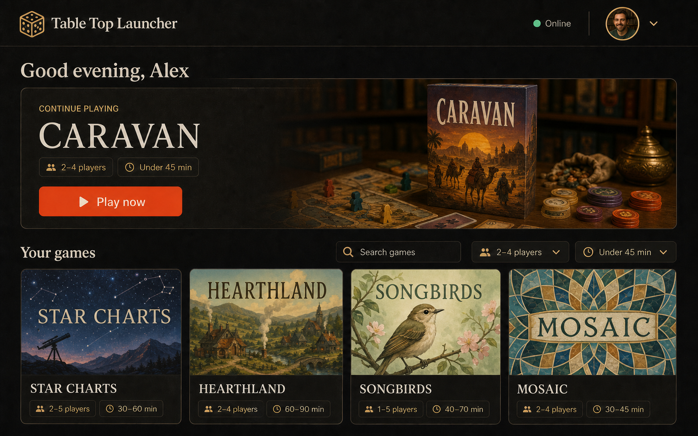
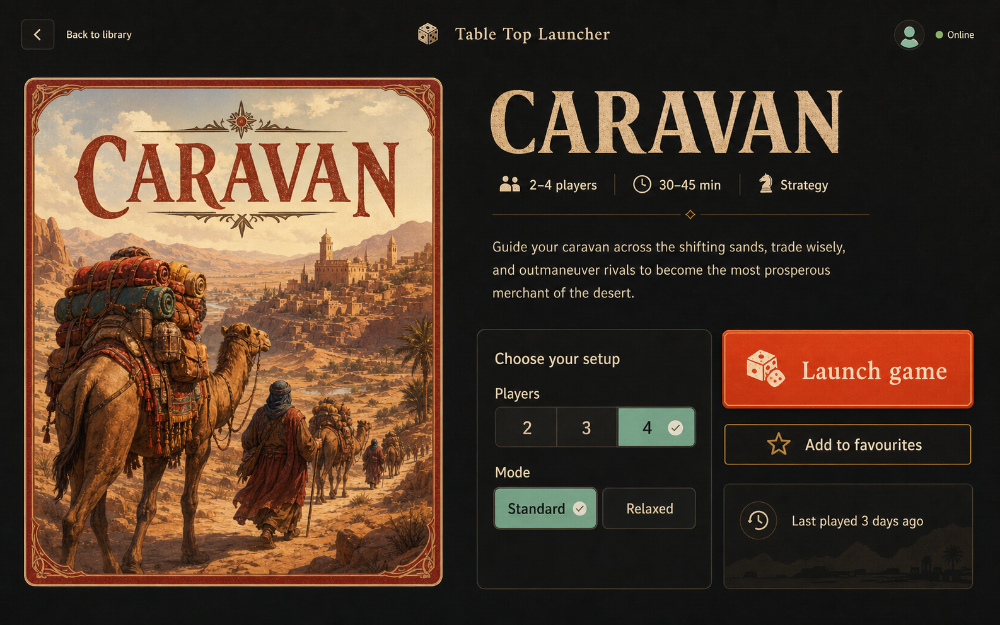
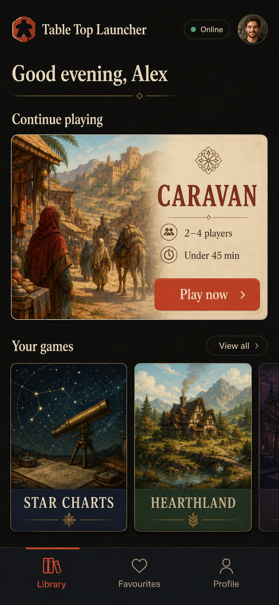

# UX and visual design

## Direction: the modern game room

Table Top Launcher should feel like opening a cabinet of favourite games in a
carefully lit room: tactile, warm, and immediately legible. It deliberately
moves away from LauncherUI's neon orbital metaphor. Games remain the visual
stars, but ordinary web interaction remains obvious.

The generated mockups are mood-and-hierarchy references. They are not shipped
assets, factual catalogue records, accessible markup, or pixel-perfect
implementation requirements. Fictional titles avoid implying a production
catalogue migration.

## Core journey

1. **Arrive:** restore or establish a guest session behind a compact branded
   shell. No sign-in page interrupts the entrance.
2. **Orient:** see connectivity/freshness, a recent-game action, and the library.
3. **Find:** search by title. Metadata filters appear only when the source data
   actually contains that metadata.
4. **Inspect:** open a deep-linkable detail surface without losing library
   position or filters.
5. **Launch:** activate one clear action; validate and open the external game.
6. **Recover:** if launch is blocked, offer a visible link/copy fallback.

## Desktop library



The desktop layout targets a 1440 × 900 design viewport and must work without
page scroll at 1280 × 720 when the catalogue fits the initial row. Larger
libraries scroll only inside the clearly bounded library region; the brand,
status, filters, and primary recent-game action remain reachable.

- Header: brand at start; connection state and profile at end.
- Greeting: quiet context, not required for function.
- Featured recent game: one high-confidence primary action.
- Library toolbar: search first, optional filters after it.
- Cards: cover/placeholder, title, real metadata, whole-card details link, and a
  separately labelled launch action when space permits.

At shared-table distances, title and launch action carry more contrast than
decorative art. Hover never reveals information that focus/touch cannot reach.

## Game detail and launch



- Back navigation restores library query, filters, focus, and scroll position.
- Art and descriptive metadata fill the first column; setup and action fill the
  second.
- Setup controls render only for fields supported by the catalogue/game URL
  contract. Version one may omit fictional mockup controls rather than invent
  their semantics.
- “Launch game” is an immediate, explicit activation—not a long press. Long
  presses are hard to discover, poor for keyboard users, and unnecessary when
  launch occurs in a separate context.
- Favourite is visually secondary and never required to launch.

## Mobile library



Mobile uses normal document scrolling; “no scroll” applies to the shared
desktop/tabletop default, not to hiding content on a phone. The recent game is
first, library cards may use a horizontal snap row for a small recent subset,
and the full library is a stable vertical list/grid. Bottom navigation must not
cover content and must respect safe-area insets.

## Responsive rules

| Width / context | Layout | Navigation | Library behavior |
| --- | --- | --- | --- |
| ≥ 1180 px, landscape | Featured panel + 4-column row | Header | Bounded library region |
| 768–1179 px | Compact feature + 2–3 columns | Header | Page or region scroll by content |
| ≤ 767 px | Single column | Bottom nav if three destinations remain | Normal page scroll |
| Mobile landscape | Compact list, no giant hero | Header/compact nav | Preserve play controls above fold |
| 200% zoom | Reflow, never horizontal document scroll | Semantic order | No clipped actions |

Breakpoints follow content failure, not specific device brands.

## Design tokens

```css
:root {
  --ink-950: #141311;
  --ink-900: #1d1b18;
  --paper-100: #f4e8d0;
  --paper-300: #d8c6a6;
  --ember-500: #e65a3a;
  --ember-600: #c9472d;
  --mint-400: #7ed6b2;
  --brass-400: #c89a52;
  --danger-400: #f08072;
  --space-1: 0.25rem;
  --space-2: 0.5rem;
  --space-3: 0.75rem;
  --space-4: 1rem;
  --space-6: 1.5rem;
  --space-8: 2rem;
  --radius-sm: 0.5rem;
  --radius-md: 0.875rem;
  --focus-ring: 0 0 0 3px #141311, 0 0 0 6px #7ed6b2;
}
```

The implementation must verify text/control colour pairs at WCAG 2.2 AA. Do
not sample colours from these generated PNGs as the accessibility source of
truth.

Use a bundled humanist sans for interface copy and a bundled display serif only
for short headings. If font licensing or rendering stability is uncertain, use
the system stack until the font ADR is approved.

## Component behavior

### Game card

- Stable cover ratio and placeholder; title remains visible if art fails.
- Details destination is a semantic link.
- Favourite is a labelled button, not a nested interactive element.
- Player/time metadata is text, not icon-only.
- Invalid launch URL never creates an active external link.

### Search and filters

- Search input has a persistent visible label (it may be visually compact, not
  placeholder-only).
- Results count changes are announced politely.
- Clear-all appears only with active filters.
- Empty results preserve controls and suggest removing filters.
- Filtering never depends on mockup-only metadata absent from Firestore.

### Status

- Mint dot plus “Online”, not colour alone.
- “Updating” while a cached snapshot is being refreshed.
- “Offline · from <time>” for a known cached snapshot.
- An error includes a retry action and retains usable cache when safe.

## Accessibility acceptance

- One logical heading hierarchy and landmark structure per route.
- Skip link, persistent visible focus, and focus restoration after route/dialog
  changes.
- All interactions work with keyboard only and at 200% zoom.
- 44 × 44 CSS-pixel minimum targets; no overlapping active controls.
- Reduced motion removes non-essential transition and parallax.
- Forced-colours mode retains borders, selected state, and focus.
- Artwork has useful alt text only when it conveys unique information; repeated
  cover art uses empty alt beside a visible title.
- Errors are associated with their region and announced without stealing focus.

## Content voice

Use short, direct language: “Play now”, “Try again”, “Offline”, “No games match
these filters”. Avoid space/systems jargon and avoid blaming the player. Never
call an anonymous Firebase session insecure or temporary; say “guest” and state
the exact persistence consequence when it matters.
